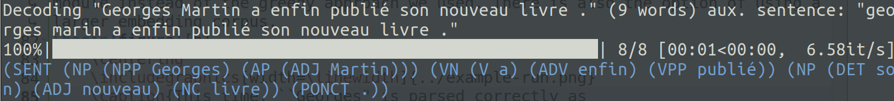

# Constituency parser for French

This work is an assignment for the MVA course "Algorithms for Speech and NLP".



## Dependencies

This code requires the Natural Language ToolKit (NLTK), NumPy and Scikit-Learn be installed.
It was tested for Python version 3.7.6 (I use type hints in my code).

The data (polyglot embeddings and Sequoia corpus) must be put at the root of this folder.

## Use


The `run.sh` script is essentially an alias for `python main.py` (and passes on any arguments given to it).

A short description of the arguments can be obtained by running the `--help` option:
```bash
python main.py --h
```

Parsing failures will return a result of the form
```
(Failure {Sentence})
```

### Evaluation on a dataset

The `--dataset` argument specifies on which dataset (`train`, `dev` or `test`) to evaluate the parser.
```bash
python main.py --dataset test  # evaluate on the test set
```
Other options:
* `--num-threads` number of multiprocessing threads for evaluating the dataset in parallel

### Custom input sentences

You can supply the parser with an *optional* input sentence from the command line using the `--input-sent` (shorthand `-is`) optional argument:
```bash
python main.py -is "C' est une affaire , vraiment ."
```
The sentence *must* be passed in with every token separated by whitespace.

### Setting the seed

The corpus is split between training, dev and test datasets using a random shuffle. To ensure reproducibility, you can set your own seed:
```bash
python main.py --seed 23 --other-args
```
The default one is 42.
